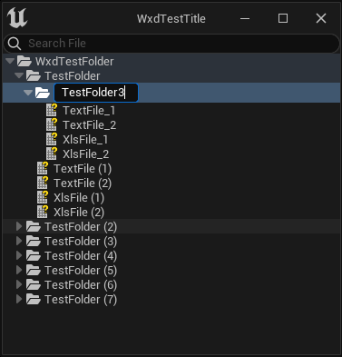

## 自定义通用树形控件开发

使用 UE 内 StreeView 控件，二次开发 Slate 基础控件。
本文及插件内容是笔者在调研过程中完成的，可能存在很多 bug，切勿当作成品控件使用，且控件内逻辑与文章逻辑一致，未按照职责划分方法及变量，切勿参考。

### 博客地址：
[自定义树形结构控件](https://santa.wang/customwidget_directorytreeview/)

### 功能：
类似于系统内容浏览器功能，但可拓展任意目录，支持所有文件，无需拓展。
且提供了多种拓展能力，本地文件操作、版本控制状态操作的示例。

### 示例效果
